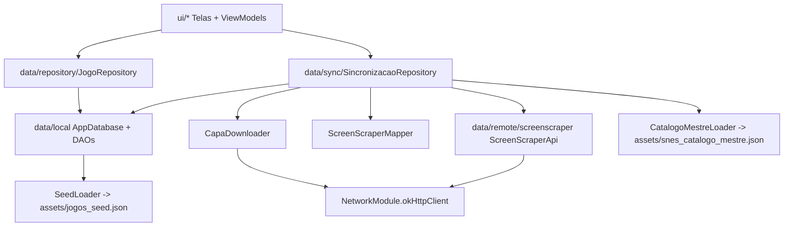
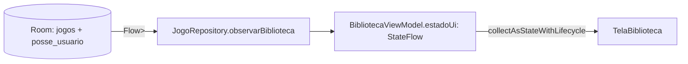
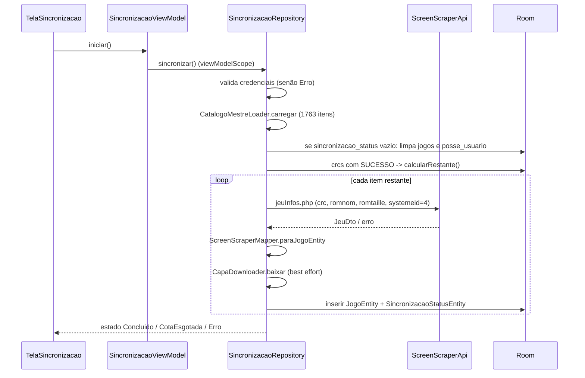

# Arquitetura

Documento derivado da leitura do código em `app/src/main/java/com/thalys/catalogosnes/`. Onde algo não pôde ser determinado pelo código, está marcado como "Não identificado".

## Visão geral

App Android de uma única Activity (`app/src/main/java/com/thalys/catalogosnes/MainActivity.kt`), UI 100% Jetpack Compose, persistência local em Room e integração com a API v2 do ScreenScraper.fr (Retrofit/OkHttp) usada apenas pela sincronização em batch. Não há framework de injeção de dependência.

## Camadas

| Camada | Pacote | Conteúdo |
|---|---|---|
| UI | `ui/biblioteca`, `ui/detalhe`, `ui/sincronizacao`, `ui/navigation`, `ui/theme` | Telas Compose, ViewModels (`StateFlow`), NavHost, tema |
| Repository | `data/repository` | `JogoRepository`: fachada de leitura/escrita do catálogo + posse |
| Sync | `data/sync` | `SincronizacaoRepository` (orquestra o batch), `CapaDownloader`, loader do catálogo mestre, estado do sync |
| Local | `data/local`, `data/local/seed` | Room: entidades, DAOs, `AppDatabase` (v3, migrações 1→2 e 2→3), seed inicial |
| Remote | `data/remote/screenscraper` | Interface Retrofit, DTOs, mapper DTO→Entity, credenciais, `NetworkModule` |
| Modelo | `data/model` | Enums `StatusPosse`, `StatusSincronizacao` |

Dependências entre camadas (conforme imports):

Observação: `JogoRepository` não referencia o ScreenScraper; somente `SincronizacaoRepository` usa a camada remote.

## Fluxo de dados

- `JogoDao.observarBibliotecaCompleta()` (`@Transaction`, `ORDER BY nome ASC`) retorna `Flow<List<JogoComPosse>>`; `JogoComPosse` usa `@Embedded` + `@Relation` (jogo 1 → 0..1 posse).
- `BibliotecaViewModel` combina (`combine`) o fluxo do repositório (pré-mapeado para `Triple(jogos, generosDisponiveis, anosDisponiveis)`), `_filtroSelecionado` e `_consultaBusca`, e expõe via `stateIn(viewModelScope, WhileSubscribed(5_000), BibliotecaUiState())`.
- A busca é exposta também como `consultaBusca: StateFlow<String>` separada.
- `DetalheJogoViewModel` não observa Flow: faz leitura pontual (`buscarJogo`, suspend) em `init` e mantém um `MutableStateFlow<DetalheUiState>` editável.
- `SincronizacaoViewModel` expõe diretamente `SincronizacaoRepository.estado` (`StateFlow<SincronizacaoEstado>`, singleton — o estado sobrevive ao ViewModel).
- Todas as telas coletam com `collectAsStateWithLifecycle()`.

## Navegação

Definida em `app/src/main/java/com/thalys/catalogosnes/ui/navigation/CatalogoNavHost.kt` (Navigation Compose, `startDestination = "biblioteca"`):

| Rota | Tela | Argumentos | Saídas |
|---|---|---|---|
| `biblioteca` | `TelaBiblioteca` | — | `detalhe/{id}` ao clicar em jogo; `sincronizacao` pelo botão de sincronizar |
| `detalhe/{jogoId}` | `TelaDetalheJogo` | `jogoId: NavType.LongType` | `popBackStack()` |
| `sincronizacao` | `TelaSincronizacao` | — | `popBackStack()` |

Filtros (menu lateral `ModalNavigationDrawer`) e busca não são rotas: são estado interno da `TelaBiblioteca`/`BibliotecaViewModel`.

## Instanciação manual (sem DI)

- Singletons com `companion object` + `@Volatile` + double-checked `synchronized`, método `obterInstancia(context)`:
  - `AppDatabase.obterInstancia` (`data/local/AppDatabase.kt`)
  - `JogoRepository.obterInstancia` (`data/repository/JogoRepository.kt`)
  - `SincronizacaoRepository.obterInstancia` (`data/sync/SincronizacaoRepository.kt`)
- `NetworkModule` é um `object` com `by lazy` para `okHttpClient`, `retrofit` (privado) e `screenScraperApi`.
- Objetos sem estado: `SeedLoader`, `CatalogoMestreLoader`, `CapaDownloader`, `ScreenScraperMapper`, `ScreenScraperCredenciais`.
- Cada ViewModel tem uma `Factory(context[, jogoId])` (`ViewModelProvider.Factory`) que busca o repositório via `obterInstancia(context.applicationContext)`; as telas usam `viewModel(factory = ...)`.

## Threading / coroutines

- DAOs: métodos `suspend` e `Flow` (Room executa fora da main thread).
- ViewModels usam `viewModelScope`.
- Seed inicial: `RoomDatabase.Callback.onCreate` dispara `CoroutineScope(Dispatchers.IO).launch { ... inserirTodos(seed) }` (escopo não estruturado).
- `SincronizacaoRepository.sincronizar()` roda o trabalho em `withContext(Dispatchers.IO)`; checa `ensureActive()` a cada item; `delay(1200ms)` de throttle; retry com backoff 2s/4s (3 tentativas); `CancellationException` é repropagada.
- `CapaDownloader` usa `OkHttp enqueue` dentro de `suspendCancellableCoroutine`, com `invokeOnCancellation { call.cancel() }`.
- Filtragem/agrupamento da biblioteca (`filtrarBiblioteca`, `generosDisponiveis`, etc.) roda dentro dos operadores `map`/`combine` sem `flowOn` explícito — o dispatcher efetivo é o do `viewModelScope` (Main). 

## Casos de uso

### Abrir biblioteca
1. `MainActivity` → `CatalogoSnesTheme` → `CatalogoNavHost` → rota `biblioteca`.
2. `BibliotecaViewModel.Factory` → `JogoRepository.obterInstancia` → `AppDatabase.obterInstancia` (na primeira criação do arquivo do banco, o callback insere os 25 jogos de `assets/jogos_seed.json`).
3. `estadoUi` emite com `filtroSelecionado = Todos`; `TelaBiblioteca` renderiza `GridDeJogos` (grade de 4 colunas, `CartaoJogo` com `AsyncImage` + selo de status).

### Filtrar / buscar
- Drawer: `aoSelecionarFiltro(FiltroBiblioteca)` → `filtrarBiblioteca()` (`ui/biblioteca/FiltroBiblioteca.kt`): Todos, Tenho, QueroTer, Faltam (status ≠ TENHO e ≠ NAO_INTERESSA, inclui sem posse), Genero(valor)/Ano(valor) incluindo "Sem gênero"/"Sem ano". O grid do filtro fica dentro de `key(estado.filtroSelecionado)`.
- Busca: `aoMudarConsultaBusca(texto)` → se não vazia, `resultadoBusca = filtrarPorNome(jogos, consulta)` (substring, `trim()`, case-insensitive) aplicado sobre a lista completa, ignorando o filtro ativo. `BackHandler` fecha a busca.

### Abrir detalhe e editar posse
1. Clique no card → `navigate("detalhe/$jogoId")`.
2. `DetalheJogoViewModel.init` → `repository.buscarJogo(id)`; se null → `jogoNaoEncontrado = true`.
3. Edições (`alterarStatus`, `alterarTemCartucho/Caixa/Manual`, `alterarNotaCondicao`) só mudam o estado em memória.
4. `salvar()` (exige status não nulo) → `salvarPosse(PosseUsuarioEntity(..., atualizadoEm = System.currentTimeMillis()))` (`REPLACE`) → `salvo = true` → `LaunchedEffect` chama `aoVoltar()`.
5. O `Flow` da biblioteca re-emite automaticamente após a escrita.
- `caminhoFoto` é preservado mas não há UI de captura/seleção (Não identificado picker no código). `JogoRepository.removerPosse` existe mas não há chamada a ele na UI (verificado por grep: Não identificado uso).

### Sincronizar catálogo

- Estados: `Ocioso`, `EmAndamento(atual,total,nome)`, `Concluido(sucesso,falhas)`, `CotaEsgotada(sucesso,restantes)`, `Erro(msg)` (`data/sync/SincronizacaoEstado.kt`).
- Cota: detectada por texto "quota"/"limite" no `header.error`, por HTTP 429/430/431, ou por 5 falhas de rede consecutivas (disjuntor).
- Checkpoint: tabela `sincronizacao_status` (por CRC); nova execução retoma só itens sem SUCESSO.
- `cancelar()` cancela o Job; o `finally` volta o estado para `Ocioso` se estava `EmAndamento`.

### Exibir capa offline
- `CapaDownloader.baixar` grava em `context.noBackupFilesDir/capas/<jogoId>.jpg` e o caminho vai para `JogoEntity.caminhoCapaLocal`.
- `JogoEntity.modeloCapa()` (`data/local/JogoEntity.kt`) devolve `File(caminhoCapaLocal)` se o campo não for nulo (não verifica se o arquivo existe em disco), senão `urlCapa`; é o `model` passado ao `AsyncImage` do Coil em `TelaBiblioteca` e `TelaDetalheJogo`.
- Configuração customizada de `ImageLoader` do Coil: Não identificado (usa o padrão).
