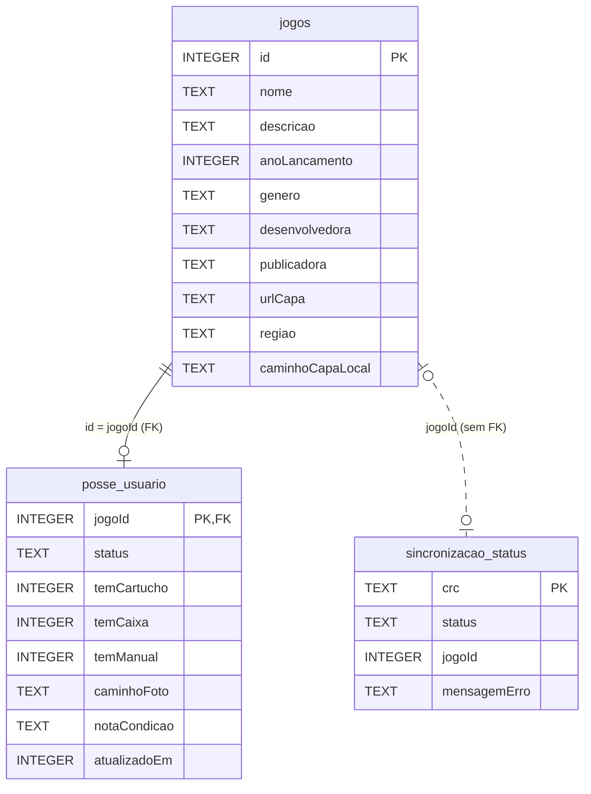

# Banco de dados local (Room)

Fonte: `app/src/main/java/com/thalys/catalogosnes/data/local/`.

## AppDatabase

Arquivo: `data/local/AppDatabase.kt`

| Item | Valor |
|---|---|
| Nome do arquivo | `catalogo_snes.db` (`NOME_BANCO`) |
| Versão | `3` |
| Entidades | `JogoEntity`, `PosseUsuarioEntity`, `SincronizacaoStatusEntity` |
| `exportSchema` | `false` (não há JSON de schema versionado) |
| TypeConverters | Nenhum declarado. Os enums `StatusPosse` e `StatusSincronizacao` são persistidos pelo suporte nativo do Room a enum (gravados como TEXT com o nome da constante — ver migration 1→2 e query `status = 'FALHA'`). |
| Acesso | Singleton `AppDatabase.obterInstancia(context)` (`@Volatile` + `synchronized`), sem DI |
| Local do arquivo | Diretório padrão do `Room.databaseBuilder` com nome simples: `/data/data/com.thalys.catalogosnes/databases/catalogo_snes.db` (caminho padrão do Android; o código não define caminho customizado) |

### Migrations

- `MIGRACAO_1_2` (1→2):
  ```sql
  CREATE TABLE IF NOT EXISTS sincronizacao_status (
      crc TEXT NOT NULL PRIMARY KEY,
      status TEXT NOT NULL,
      jogoId INTEGER,
      mensagemErro TEXT
  )
  ```
- `MIGRACAO_2_3` (2→3):
  ```sql
  ALTER TABLE jogos ADD COLUMN caminhoCapaLocal TEXT
  ```

Não há `fallbackToDestructiveMigration`.

### Callback de seed

`RoomDatabase.Callback.onCreate` (roda só quando o arquivo do banco é criado) lança em `CoroutineScope(Dispatchers.IO)`:
`SeedLoader.carregarJogosSeed(context)` → `jogoDao().inserirTodos(...)`. Popula `jogos` a partir de `assets/jogos_seed.json`.

Observação: na primeira sincronização (quando `sincronizacao_status` está vazia), `SincronizacaoRepository` troca o catálogo do seed pelo do ScreenScraper; a sync salva as posses existentes em `filesDir/posses_pendentes_sync.json` (`PossesPendentesStore`, junto com pendências antigas), depois executa `posseUsuarioDao.limparTudo()` e `jogoDao.limparTudo()` (posse primeiro, por causa da FK). A cada jogo inserido pela sync, a posse pendente de mesmo nome normalizado (`normalizarNomeParaCasamento`: minúsculas, sem acento, sem pontuação, sem "the") é regravada com o id novo e sai do arquivo. Pendências sem casamento ficam no arquivo e são tentadas de novo nas syncs seguintes (`data/sync/PossesPendentes.kt`).

## Entidades

### `jogos` — `JogoEntity` (`data/local/JogoEntity.kt`)

Metadados do catálogo.

| Coluna | Tipo Kotlin | SQLite | Nulo | Default | Observação |
|---|---|---|---|---|---|
| `id` | `Long` | INTEGER | não | — | PK (não autogerada; vem do seed ou do id do ScreenScraper) |
| `nome` | `String` | TEXT | não | — | |
| `descricao` | `String?` | TEXT | sim | — | |
| `anoLancamento` | `Int?` | INTEGER | sim | — | |
| `genero` | `String?` | TEXT | sim | — | |
| `desenvolvedora` | `String?` | TEXT | sim | — | |
| `publicadora` | `String?` | TEXT | sim | — | |
| `urlCapa` | `String?` | TEXT | sim | — | URL remota da capa |
| `regiao` | `String?` | TEXT | sim | — | |
| `caminhoCapaLocal` | `String?` | TEXT | sim | `null` (Kotlin) | Adicionada na v3; caminho absoluto do arquivo da capa em disco |

Índices: nenhum além da PK. FKs: nenhuma.

Função de extensão `JogoEntity.modeloCapa(): Any?` = `caminhoCapaLocal?.let { File(it) } ?: urlCapa` (modelo passado ao `AsyncImage` do Coil).

### `posse_usuario` — `PosseUsuarioEntity` (`data/local/PosseUsuarioEntity.kt`)

Dados pessoais do usuário sobre um jogo.

| Coluna | Tipo Kotlin | SQLite | Nulo | Default (Kotlin) |
|---|---|---|---|---|
| `jogoId` | `Long` | INTEGER | não | — (PK) |
| `status` | `StatusPosse` (`TENHO`, `QUERO_TER`, `NAO_INTERESSA`) | TEXT | não | — |
| `temCartucho` | `Boolean` | INTEGER | não | `false` |
| `temCaixa` | `Boolean` | INTEGER | não | `false` |
| `temManual` | `Boolean` | INTEGER | não | `false` |
| `caminhoFoto` | `String?` | TEXT | sim | `null` |
| `notaCondicao` | `String?` | TEXT | sim | `null` |
| `atualizadoEm` | `Long` | INTEGER | não | — |

- PK: `jogoId` (relação 1:0..1 com `jogos`).
- FK: `jogoId` → `jogos.id`, sem `onDelete`/`onUpdate` explícitos (padrão `NO_ACTION`).
- Índices: nenhum declarado (a coluna FK já é a PK).
- Defaults acima são do construtor Kotlin; não há `@ColumnInfo(defaultValue)`.

### `sincronizacao_status` — `SincronizacaoStatusEntity` (`data/local/SincronizacaoStatusEntity.kt`)

Checkpoint do sync em batch. "Pendente" = ausência de linha para o crc.

| Coluna | Tipo Kotlin | SQLite | Nulo |
|---|---|---|---|
| `crc` | `String` | TEXT | não (PK) |
| `status` | `StatusSincronizacao` (`SUCESSO`, `FALHA`) | TEXT | não |
| `jogoId` | `Long?` | INTEGER | sim |
| `mensagemErro` | `String?` | TEXT | sim |

Sem FK (o `jogoId` é informativo) e sem índices extras.

## Relacionamento: `JogoComPosse`

`data/local/JogoComPosse.kt`:

```kotlin
data class JogoComPosse(
    @Embedded val jogo: JogoEntity,
    @Relation(parentColumn = "id", entityColumn = "jogoId")
    val posse: PosseUsuarioEntity?,
)
```

Cada jogo com sua posse opcional (1 para 0..1).

## DAOs

### `JogoDao` (`data/local/JogoDao.kt`)

| Método | SQL / anotação | Retorno |
|---|---|---|
| `inserirTodos(jogos)` | `@Insert(onConflict = REPLACE)` | `suspend` |
| `observarBibliotecaCompleta()` | `@Transaction` `SELECT * FROM jogos ORDER BY nome ASC` | `Flow<List<JogoComPosse>>` |
| `buscarPorId(jogoId)` | `@Transaction` `SELECT * FROM jogos WHERE id = :jogoId` | `suspend`, `JogoComPosse?` |
| `limparTudo()` | `DELETE FROM jogos` | `suspend` |

### `PosseUsuarioDao` (`data/local/PosseUsuarioDao.kt`)

| Método | SQL / anotação | Retorno |
|---|---|---|
| `salvar(posse)` | `@Insert(onConflict = REPLACE)` | `suspend` |
| `remover(jogoId)` | `DELETE FROM posse_usuario WHERE jogoId = :jogoId` | `suspend` |
| `limparTudo()` | `DELETE FROM posse_usuario` | `suspend` |

### `SincronizacaoStatusDao` (`data/local/SincronizacaoStatusDao.kt`)

| Método | SQL / anotação | Retorno |
|---|---|---|
| `salvar(status)` | `@Insert(onConflict = REPLACE)` | `suspend` |
| `buscarCrcsPorStatus(status = SUCESSO)` | `SELECT crc FROM sincronizacao_status WHERE status = :status` | `suspend`, `List<String>` |
| `buscarFalhas()` | `SELECT * FROM sincronizacao_status WHERE status = 'FALHA'` | `suspend`, `List<SincronizacaoStatusEntity>` |
| `contarLinhas()` | `SELECT COUNT(*) FROM sincronizacao_status` | `suspend`, `Int` |

Acesso de alto nível: `data/repository/JogoRepository.kt` (`observarBiblioteca`, `buscarJogo`, `salvarPosse`, `removerPosse`) e `data/sync/SincronizacaoRepository.kt`.

## Diagrama ER



## Assets

### `app/src/main/assets/jogos_seed.json`

- Lido por `data/local/seed/SeedLoader.kt` (`Json { ignoreUnknownKeys = true }`) em `List<JogoSeedDto>` e convertido para `JogoEntity`.
- Formato: array JSON de objetos com os campos de `JogoEntity` (menos `caminhoCapaLocal`), com `id` fixo:
  ```json
  { "id": 1, "nome": "Super Mario World", "descricao": "...", "anoLancamento": 1990,
    "genero": "Plataforma", "desenvolvedora": "Nintendo EAD", "publicadora": "Nintendo",
    "urlCapa": null, "regiao": "us" }
  ```
- Contagem: **25** itens (medido com `python3`).

### `app/src/main/assets/snes_catalogo_mestre.json`

- Gerado pelo módulo `:ferramentas` a partir do DAT No-Intro; lido por `data/sync/CatalogoMestreLoader.kt` em `List<CatalogoMestreItemDto>`.
- Não vai para o Room diretamente: é a lista de entrada do sync (cada item consultado no ScreenScraper).
- Formato:
  ```json
  { "romNome": "'96 Zenkoku Koukou Soccer Senshuken (Japan).sfc",
    "crc": "05fbb855", "romTamanho": 1572864,
    "nomeExibicao": "'96 Zenkoku Koukou Soccer Senshuken (Japan)" }
  ```
- Contagem: **1763** itens (medido com `python3`).

## Capas em disco

- `data/sync/CapaDownloader.kt` salva cada capa em `context.noBackupFilesDir/capas/<jogoId>.jpg` (extensão sempre `.jpg`, independentemente do formato real) e grava o caminho absoluto em `jogos.caminhoCapaLocal`.
- `noBackupFilesDir` fica fora do Android Auto Backup (o Manifest tem `android:allowBackup="true"`, então o banco em si é elegível a backup; as capas não).
- Não há rotina de limpeza de capas órfãs: Não identificado no código.
